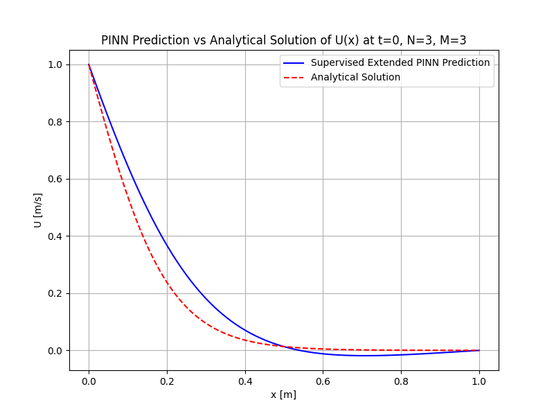
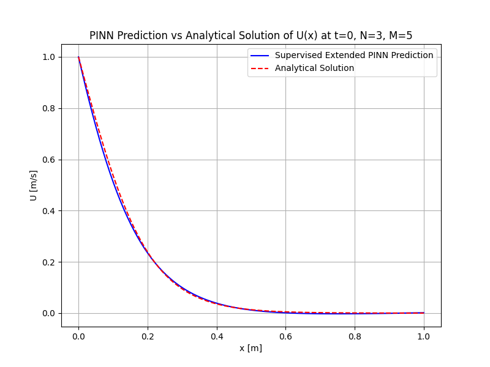
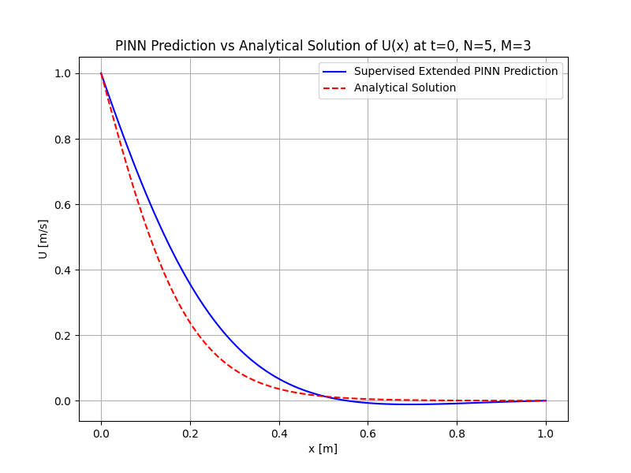
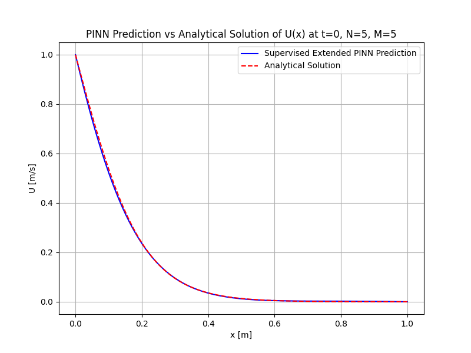
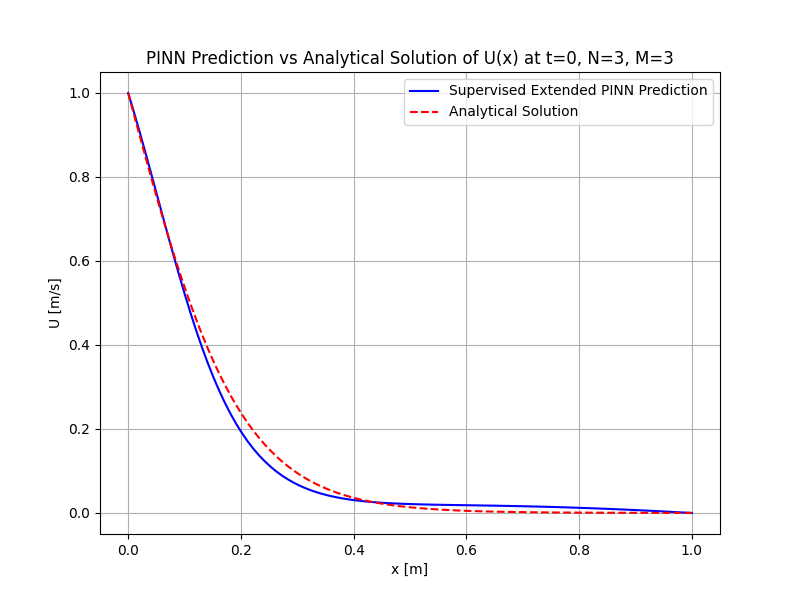
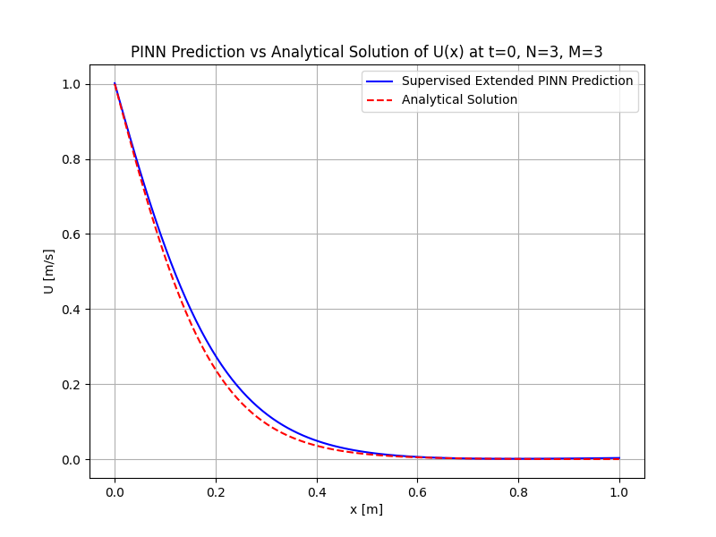
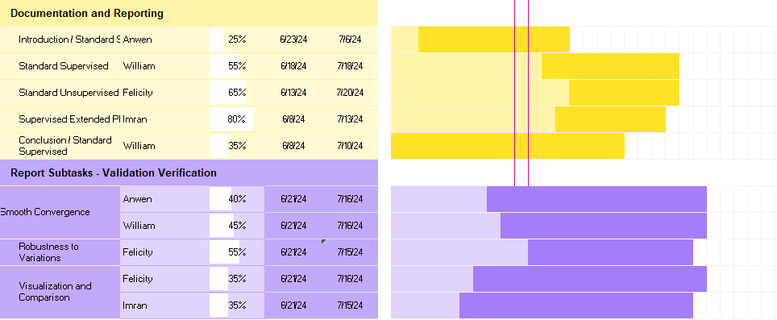

# PINN – Midterm Report of Supervised and Unsupervised

# Predictions of 1D Berger Equation

### He. Anwen, Felicity. N, I. Aziz, William E. Zhang

### May 2024

## Introduction/Background

The prediction and simulation of fluid partial differential equations (PDEs) are inherently challeng-
ing due to the nonlinear nature of the simulations and their design. In this study, we demonstrate
the application of PINNs to the 1D Burgers’ PDE to further explore the topic of neural networks
in the context of physics-informed predictions.
Direct solving of the PDE is compared and given to the resolution methods of lines proposed
by Biazar et al. [2]. The accuracy and efficiency are directly compared to the feasibility and
prediction of the PINN [3]. The direct solution is compared and estimated from the residuals of
the epochs of the machine learning process, and the data is feed-forwarded from the PDE residuals
to epochs. The final prediction for the 1D Burgers’ equation is solved and compared to the exact
solution.

$$
\frac{\partial u}{\partial t} + u\frac{\partial u}{\partial x} = \nu \frac{\partial^2 u}{\partial x^2}.
$$

Derived by Harry Bateman [1], the solution for $` f^{+} = 2, f^{-} = 0, c = 1 `$ results in the following analytical solution to the PDE:

$$
u(x,t) = \frac{2}{1 + e^{\frac{x-t}{\nu}}}
$$

## 1 Problem Definition and Motivation

Solving systems of turbulent flow is a persistent and challenging issue in the field of fluid dynamics.
Understanding these systems is important for many problems including those in aerodynamics,
fluid spray dynamics, and atmospheric modeling to name a few.
Physics informed neural networks (PINNs) are new way to solve tough problems that follow
physical laws, especially when there is a lack of available data. To make predictions, PINNs embed
prior knowledge of physical laws in the learning process. Traditional high fidelity methods like
computational fluid dynamics (CFD) or FEM are computationally expensive, but PINNs offer
an alternative method that is much faster and requires less data. These methods can be applied
in many real world scenarios to make predictions and facilitate in design and decision making processes, including problems in thermodynamics, climate sciences, and CFD. In our project, we
apply PINN models to solve the 1D Burger’s equation. The 1D Burger’s equation is a simplification
of the Naiver-Stokes equation and solving this simplified system using a neural network is a
preliminary step in applying machine learning methods to more complex representations of fluid
dynamical systems.

## 2 Methods

We use a Supervised Extended Physics-Informed Neural Network to solve the Burger’s Equation.

### 2.1 Data Pre-processing

The data is simplified from the full Burger's equation under steady propagating wave solutions [1].

$$
\frac{\partial u}{\partial t} + u\frac{\partial u}{\partial x} = \nu \frac{\partial^2 u}{\partial x^2}.
$$

Which simplifies to the below expression:

$$
u(x,t) = c - \frac{f^{+} - f^{-}}{2}\tanh\left[\frac{f^{+} - f^{-}}{4\nu}(x - ct)\right].
$$

For the analytical solution comparison with the extended supervised model, additional parameters of  $` f^{+} = 2, f^{-} = 0, c = 1 `$ are used to compare with the analytical solution below; the simplification with these given parameters is in accordance with Bateman's [harryBateman1915] solutions simplifications.

$$
u(x,t) = \frac{2}{1 + e^{\frac{x-t}{\nu}}}
$$

### 2.2 Dataset Generation

The analytical training dataset included within the PDE generation of Berger's Equation via the analytical function below.

$$
u(x,t) = \frac{2}{1 + e^{\frac{x-t}{\nu}}}
$$

And the residual dataset from the PDE is generated via the function below for residual losses; this function is equivalent to the analytical solution given ($f^+ = 2$), ($f^- = 0$), and ($c = 1$) .

$$
u(x,t) = c - \frac{f^{+} - f^{-}}{2}\tanh\left[\frac{f^{+} - f^{-}}{4\nu}(x - ct)\right].
$$

The grid is uniformly sampled for MSE PDE analytical solution comparisons (N points), and the grid is randomly sampled for residual losses (M points).

2.2.1 Training and Validation Data

- Training Data:
    - Initial Condition Points (K): Specific points at the boundaries of the domain (x=
       and x=1 at t=0).
    - Residual Points M: Randomly selected points within the domain to sample resid-
       uals throughout the domain.
    - Analytical Data Points N: Uniformly selected points within the domain to sample
       analytical velocity to compare against predicted velocity.
- Validation Data: Analytical solutions within the domain are used to validate the model’s
    accuracy in the visualization of data as a baseline.

2.2.2 Initial and Boundary Conditions

The initial condition is set at $t=0$, where the boundary conditions of $`U(x=0,t=0) = 1`$ and
$`U(x=1,t=0)=0`$ are given by the Bateman solutions for the supervised extended learning.

- Initial Condition: At $`t=0`$, $`u(x=0,t=0) = 1`$ and $`u(x=1,t=0) = 0`$. This is included in
    the loss function as the initial condition loss.
- Boundary Condition: Boundaries are set at $`x=0`$ and $`x= 1`$. The actual values of $u$ at
    these boundaries are implicitly handled by the model through the learning process.

### 2.3 Model - Supervised Extended PINN

The supervised extended PINN model uses a loss function that is a combination of the data loss
(difference between predictions and labeled data) and the PDE residuals:

$$
L_{\text{PDE}} = \frac{1}{M} \sum_{j=1}^{M} \left( u_t(x_j, t_j) + u(x_j, t_j) u_x(x_j, t_j) - \nu u_{xx}(x_j, t_j) \right)^2
$$

$$
L_{\text{data}} = \frac{1}{N} \sum_{i=1}^{N} \left( u_{\text{pred}}(x_i, t_i) - u_{\text{data}}(x_i, t_i) \right)^2
$$

$$
L_{\text{BC}} = \frac{1}{K} \sum_{k=1}^{K} \left( u_{\text{pred}}(x_{b_k}, t_{b_k}) - u_{b_k} \right)^2
$$

K is the number of boundary condition points. M is the number of collocation points specified for
the PDE (residual losses), which are randomly selected within the grid. N is the number of grid
points uniformly sampled within the grid.

$$
L = L_{\text{data}} + L_{\text{PDE}} + L_{\text{BC}}
$$

2.3.1 Neural Network Architecture

The architecture consists of three layers:

- Input Layer: Two inputs, x (spatial coordinate) and t (time coordinate).
- Hidden Layer: Contains 5 neurons per layer with Tanh activation functions.
- Output Layer: Produces the final prediction of the velocity field u(x,t).

2.3.2 Activation Function: Tanh

Tanh is used as the activation function. It handles non-linear relationships well and outputs values
between -1 and 1, which is centered at 0. The Tanh relation is stronger gradients compared to
sigmoid activation function at points away from -1 and 1. Tanh is therefore chosen as the activation
function of choice.

2.3.3 Optimizer: Adam

The Adam optimizer is used to train the model. This optimizer adjusts the learning rate for
each parameter, which helps the model converge faster. It combines the benefits of two other
optimization techniques, AdaGrad and RMSProp, for more efficient learning. The Adam optimizer
makes suitable updates to the model parameters, balancing between speed and accuracy.

## 3 Results and Discussion

In this section, the results of the Physics-Informed Neural Network (PINN) approach to solve the
1-D Burgers’ equation are presented. The model’s predictions are compared with the analytical
solutions provided by Harry Bateman [1]. The discussion covers the performance of the model
under various combinations of residual points N and analytical points M, varying epochs, and
different hidden layer configurations.

### 3.1 N and M points variance in Extended Supervised Learning Model

Learnign rate = 0.1 Defined at a 1 hidden layer , 5 neurons nu at 0.1 Epcoh at 1000

3.1.1 Baseline N=3, M=3

In this setup, the number of sample or residual points N and analytical points M are both set to
3. The training time is approximately 2.82 seconds, which serves as the baseline for comparison
with other configurations.

3.1.2 Effect of variation of N and M

From the baseline, different configurations are experimented with different N and M points,
specifically N = 3, M = 5, N = 5, M= 3, and N = 5, M = 5, to observe their impact on the
model’s performance. For N = 3, M = 5, the training time is approximately 2.76 seconds. For
both N = 5, M= 3 and N = 5, M = 5, the training time is approximately the same, around
2.85 seconds. The plots depict the model’s predictions for each configuration compared to the
analytical solution. The closer the model’s prediction (blue line) is to the analytical solution (red
dashed line), the better the model’s performance. It is observed that increasing N from 3 to 5
while keeping M=3 does not significantly enhance the model’s accuracy. However, increasing M
from 3 to 5 notably improves the model’s accuracy, with only a slight variation when N is changed
from 3 to 5. The improvement in M from 3 to 5 results in the R-squared value increasing from
0.92 to 0.95. The R-squared value is calculated from the difference between the predicted and
analytical solution.

### Neural Network Architecture
The architecture consists of three layers:

- **Input Layer**: Two inputs,  x  (spatial coordinate) and  t  (time coordinate).
- **Hidden Layer**: Contains 5 neurons per layer with Tanh activation functions.
- **Output Layer**: Produces the final prediction of the velocity field  u(x, t) .

### Activation Function: Tanh
Tanh is used as the activation function. It handles non-linear relationships well and outputs values between -1 and 1, which is centered at 0. The Tanh relation has stronger gradients compared to the sigmoid activation function at points away from -1 and 1. Tanh is therefore chosen as the activation function of choice.

### Optimizer: Adam
The Adam optimizer is used to train the model. This optimizer adjusts the learning rate for each parameter, which helps the model converge faster. It combines the benefits of two other optimization techniques, AdaGrad and RMSProp, for more efficient learning. The Adam optimizer makes suitable updates to the model parameters, balancing between speed and accuracy.

## Results and Discussion
In this section, the results of the Physics-Informed Neural Network (PINN) approach to solve the 1-D Burgers' equation are presented. The model's predictions are compared with the analytical solutions provided by Harry Bateman. The discussion covers the performance of the model under various combinations of residual points N and analytical points M, varying epochs, and different hidden layer configurations.

### N and M points variance in Extended Supervised Learning Model
All cases are run at the following parameters, unless otherwise specified in the changes per subsection. A learning rate = 0.1, 1 hidden layer, and 5 neurons are set. The points of M = 3, N = 3, K = 2 are defined. A viscosity of $`\nu = 0.1`$ is set. An epoch count of 1000 is used.

#### Baseline $`N=3, M=3`$
In this setup, the number of sample or residual points N and analytical points M are both set to 3. The training time is approximately 2.82 seconds, which serves as the baseline for comparison with other configurations.

#### Effect of variation of N and M
From the baseline, different configurations are experimented with different N and M points, specifically N=3, M=5, N=5, M=3, and N=5, M=5, to observe their impact on the model's performance. For N=3, M=5, the training time is approximately 2.76 seconds. For both N=5, M=3 and N=5, M=5, the training time is approximately the same, around 2.85 seconds. The plots depict the model's predictions for each configuration compared to the analytical solution. The closer the model's prediction (blue line) is to the analytical solution (red dashed line), the better the model's performance. It is observed that increasing N from 3 to 5 while keeping M = 3 does not significantly enhance the model's accuracy. However, increasing M from 3 to 5 notably improves the model's accuracy, with only a slight variation when N is changed from 3 to 5. The improvement in M from 3 to 5 results in the R-squared value increasing from 0.92 to 0.95. The R-squared value is calculated from the difference between the predicted and analytical solution.

Conversely, increasing the number of residual points N from 3 to 5 does not have as substantial an impact on accuracy.

Therefore, it is found that the most influential parameter is the number of analytical points M. This observation is logical because using more analytical points in the PDE loss term allows the model to learn more accurately and effectively bridge the gap between predicted and actual data. Residual points N play a critical role in enforcing PDE constraints across the domain, ensuring that the model's predictions adhere closely to the underlying physical laws. While these points maintain solution consistency, they do not directly assess the accuracy of the solution against known data points.

On the other hand, analytical points M directly compare the model's predictions to known, accurate solutions at specific locations, providing strong feedback for adjusting the model. This direct comparison is crucial for improving accuracy, especially when the model can use this information to correct itself. Therefore, while residual points N are important for ensuring the solution adheres to the PDE, they do not directly influence the accuracy as much as the analytical points M.

**Figure**: Effect of Sample points N and Analytical point M variance on Accuracy of Extended Supervised PINN

### Effect of Hidden Layers

The effect of the number of hidden layers on the model's performance is recorded. The results showed that for one hidden layer, the training time was approximately 2.82 seconds, whereas for two hidden layers, the training time was approximately 3.01 seconds. The performance plots revealed that increasing the number of hidden layers slightly increased the training time. This also led to a slight improvement in the model's accuracy as measured by the R-squared value. 

More hidden layers can help the model learn more complex relationships in the data, but they also increase computational complexity and training time. More hidden layers allow the model to capture more complex patterns in the data, potentially leading to better accuracy. This happens because additional layers enable the model to learn more detailed representations of the input data, which can improve its ability to generalize and predict the velocity field accurately.

**Figure**: Effect of Hidden Layers on Model Performance

### Effect of Epochs

The effect of the number of epochs (training iterations) on the model's performance is recorded. The results indicated that with 1000 epochs, the training time was approximately 2.82 seconds, and with 2000 epochs, the training time was approximately 4.62 seconds. The performance figures demonstrated that increasing the number of epochs improves the model's predictions, as the model has more opportunities to learn from the data. More epochs mean the model goes through the training data multiple times, allowing it to refine itself and reduce errors gradually. However, this also increases the training time. The improvement in accuracy with more epochs is due to the model having more time to adjust and converge towards a solution that better fits the data.

**Figure**: Epoch 1000 vs 2000

### Results of Different Configurations

| N | M | Hidden Layers | Epochs | $R^2$ | Time (s) |
|---|---|----------------|--------|-------|----------|
| 3 | 3 | 1 | 1000 | 0.92 | 2.82 |
| 3 | 5 | 1 | 1000 | 0.95 | 2.76 |
| 5 | 3 | 1 | 1000 | 0.93 | 2.85 |
| 5 | 5 | 1 | 1000 | 0.96 | 2.85 |
| 3 | 3 | 2 | 1000 | 0.93 | 3.01 |
| 3 | 3 | 1 | 2000 | 0.94 | 4.62 |

**Table**: Results of Different Configurations

### 3.4 Next Steps

There were mentioned three methods in our initial proposal report i.e. Supervised standard PINN,
Supervised extended PINN and Unsupervised PINN. In this report, the supervised extended PINN
is implemented. Transforming from a supervised extended PINN to a supervised standard PINN
is straightforward, as only the loss due to initial conditions is removed. In the next step, we
will implement an unsupervised PINN. An unsupervised PINN differs from a supervised extended
PINN in that it relies solely on the PDE residual without explicit training data – i.e. no MSE
loss from boundary conditions and analytical solution to compare. This approach means that
no known solutions will be used for training. Instead, the loss function will focus exclusively on
residuals and the inherent physics of the problem.
The three models are ready to be implemented, as the supervised extended model already
contains the loss functions separately and implementable. It remains to be seen the performance
and accuracy gained from the removal of these losses. Regardless, the combination of all three
losses have been demonstrated and recorded for the variation of parameters investigated.

# 4 Conclusion

In conclusion, the current implementation employs a Supervised Extended Physics-Informed Neural Network to solve the 1-D Burgers' equation. The input layer incorporates spatial and temporal coordinates into the neural network, which utilizes a Tanh activation function in a single hidden layer before making predictions in the output layer, $` U(x, t) `$. The predictions are trained and tested by combining initial condition loss, residual loss, and PDE loss. Through this approach, the model accurately predicts how the velocity field $` U `$ changes over time and space, leveraging known solutions and appropriate adjustments guided by fundamental principles of physics.

## 5 Goals

1. Analysis of Burgers’ Equation Using PINN:Analyze and reconstruct the flow field of
the Burgers’ equation using both supervised and unsupervised PINNs.
    
2. Accurate Solution Capture:Ensure the PINN model accurately replicates the analytical
solutions of the Burgers’ equation

3. Effective Sampling: Use smart sampling techniques, such as adaptive and weighted
sampling, to focus on complex regions with significant changes

4. Smooth Convergence: Achieve smooth and efficient training of the model, indicating
effective learning and proper convergence to the solution.

5. Robustness to Variations:Ensure the model remains accurate even with uncertainties
in initial and boundary conditions

6. Optimized Training: Balance accuracy and computational efficiency by optimizing the
network architecture and training parameters.

7. Visualization and Comparison:Visualize the flowfield solution, comparing it with analytical solutions to differences within numerical simulation.

## References

[1] H. Bateman. “Some Recent Researches on the Motion of Fluids”. In:Monthly Weather Review
43.4 (Jan. 1915), p. 163.

[2] J. Biazar, Z. Ayati, and S. Shahbazi. “Solution of the Burgers Equation by the Method of
Lines”. In:American Journal of Numerical Analysis 2 (Jan. 2014), pp. 1–3.

[3] Z. Meng, Q. Qian, M. Xu, B. Yu, A. R. Yıldız, and S. Mirjalili. “PINN-FORM: A new
physics-informed neural network for reliability analysis with partial differential equation”.
In:Computer Methods in Applied Mechanics and Engineering 414 (2023), p. 116172.issn:
0045-7825.

## Contributions Table

## Gantt Chart

